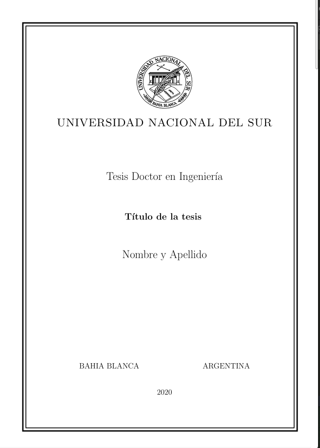

# Plantilla para tesis doctorales U.N.S.

## El tesista debe enviar:
1. Una copia completa de la versión final de la tesis de posgrado en archivo pdf (debe coincidir con la versión final de tesis que se entrega impresa, aprobada por el Director y los Jurados de la defensa oral). La biblioteca como dependencia receptora no tiene facultades ni capacidad para brindar la garantía de coherencia entre ambas versiones. Este archivo electrónico será depositado en el Repositorio Institucional Digital.

2. El/los archivo/s digitales editables utilizados para elaborar la versión final de la tesis. Indicar el contenido de cada uno de estos archivos y la versión del programa utilizado para la edición del documento (Por ejemplo, documento/s MS Word 2016, archivos CAD versión…, etc.).  Este archivo Word de la tesis, se guarda con fines de preservación digital.

3. Licencia de depósito y acuerdo de cesión no exclusiva de derechos entre el autor y la Biblioteca Central “Profesor Nicolás Matijevic”: es un documento necesario para realizar el depósito de la tesis en el [Repositorio Institucional Digital](https://repositoriodigital.uns.edu.ar/) de la Universidad Nacional del Sur que certifica:  
   - La fecha de depósito del documento de tesis, y los compromisos que la Universidad Nacional del Sur asume.  
   - La prestación de conformidad por parte del autor para comunicación pública y la puesta a disposición de la obra por Internet, de forma libre y gratuita del documento de su autoría.
   - Debe entregarse el original y firmarlo con tinta azul.  

4. Cuando ya esté depositada su tesis en el Repositorio, le enviaremos un correo para avisarle. Además, deberá completar una encuesta, esto es muy importante para detectar posibles errores en los datos registrados en el Repositorio.

Todas estas acciones apuntan a registrar antecedentes relacionados con el derecho de autor y la publicación de documentos de contenido científico, cumpliendo con la [misión](http://bc.uns.edu.ar/es/content/qui%C3%A9nes-somos) de la  Biblioteca Central “Profesor Nicolás Matijevic” de preservar y difundir la producción científica y académica de la Universidad Nacional del Sur, tal que la sociedad pueda beneficiarse de los conocimientos generados y desarrollados en el marco institucional de la institución.

El evidente ahorro de espacio y la variedad de opciones en el manejo de la preservación (con sus complejidades) son notables avances cuando se considera la circulación y el deterioro físico de los materiales en una biblioteca académica. El entorno digital sugiere nuevas formas de considerar los documentos y también colaborar en el cuidado de los derechos de autor sin asumir responsabilidades más allá de las que competen a la biblioteca (preservar, dar acceso y difundir).

Derechos del Autor: las tesis pueden considerarse obras inéditas y son escasas las ocasiones en que sus jurados recomiendan su publicación en forma de libro, y rara vez se registran como obras literarias.

Podría ser importante la inscripción en el registro de la [Dirección Nacional de Derecho de Autor](https://www.argentina.gob.ar/justicia/derechodeautor), esto genera la presunción de que un determinado autor ha producido una obra intelectual y la fecha de registro da fe de una presunta originalidad, aunque el derecho mismo nace con la creación y no con la inscripción. Esto requiere una renovación periódica y una vez publicada la obra, debe registrarse como obra publicada. Este trámite de registro no forma parte del proceso de depósito de la versión digital de la tesis en el [Repositorio Institucional Digital](http://tesis.uns.edu.ar/). Se menciona aquí como una opción que el autor tiene a su alcance para dejar constancia de su condición de autor.

Licencia de depósito. Acuerdo de cesión no exclusiva de derecho de tesis (descargar formulario):

[Versión .pdf](http://bc.uns.edu.ar/sites/default/files/BCUNS%20-%20licencia%20de%20dep%C3%B3sito%20en%20RID.pdf)  
[Versión .doc](http://bc.uns.edu.ar/sites/default/files/BCUNS%20-%20licencia%20de%20dep%C3%B3sito%20en%20RID.doc)  
[Versión .odt](http://bc.uns.edu.ar/sites/default/files/BCUNS%20-%20licencia%20de%20dep%C3%B3sito%20en%20RID.odt)  